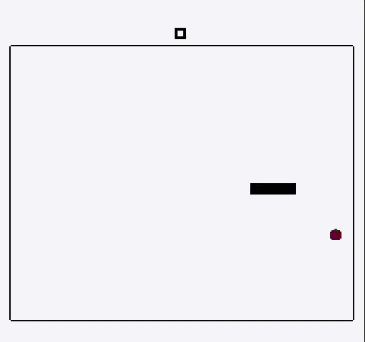

# 🐍 RL Snake
A snake game made for the NES as a university assignment focused on low-level programming in 2022 📚


## 🔨 How to Build
The build has only been tested on Linux 🐧

### Requirements
- Make
- cc65 (included in the repo. If using git, clone with the `--recursive` flag)

To build the rom:
```sh
make
```

## 🎮 How to Play
Get an emulator like [Mesen](https://www.mesen.ca/) and open the ROM from the `build` directory after building it. Control the snake with the D-pad buttons